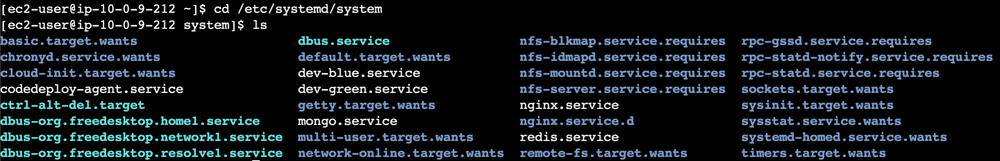

# EC2-DOCKER-AUTO-RESTART

들어가기전, EC2 서버 환경은 Amazon-Linux-2023 입니다.

프로그래머스 데브코스 기간 중 서버가 매일 오전 10시에 켜지고 새벽 2시에 꺼지도록 자동으로 설정이 되어있었습니다.
인프라를 담당하고 있던 제가 만약 누군가가 서버를 사용해야 한다면 새벽 2시까지 기다렸다가 서버를 켜주어야 하는 불편함이 있었습니다.

개발을 할 때부터 EC2 서버가 켜지면 필요한 Docker-Container 들이 실행되었으면 하는 생각이 있었습니다.
프로젝트 종료 이후 해당 방법을 해결하기 위한 방법을 찾아봤고, 비교적 간단한 방법으로 설정 할 수 있었습니다.

1. systemctl 을 등록 할 수 있도록 service 들이 모여있는 directory 로 이동

```bash
cd /etc/systemd/system
```


실제로 많은 서비스들이 있는 것을 확인 할 수 있습니다.

2. docker container를 자동으로 실행시키기 위한 service 작성

먼저, 현재 저는 redis server, mongo server는 분리되는 것이 더 낫다는 생각을 가지고 있으나 서버를 이렇게 하나 하나 분리하기에는 서버 비용을 너무 많이 사용해서 지금은 하나의 ec2에서 띄우고 있습니다.

다른 container에 의존하지 않는 redis, mongo service 스크립트를 먼저 살펴보겠습니다.

### Redis

```bash
[Unit]
Description=Redis Container
After=docker.service
Requires=docker.service

[Service]
RemainAfterExit=yes
ExecStart=/usr/bin/docker start redis
ExecStop=/usr/bin/docker stop redis

[Install]
WantedBy=default.target
```

### Mongo

```bash
[Unit]
Description=MongoDB Container
After=docker.service
Requires=docker.service

[Service]
RemainAfterExit=yes
ExecStart=/usr/bin/docker start mongo
ExecStop=/usr/bin/docker stop mongo

[Install]
WantedBy=default.target
```

두 개의 코드가 크게 다르지 않음을 알 수 있습니다. 이어서, 스프링 부트 서버를 확인해보도록 하겠습니다.

### Spring boot

```bash
[Unit]
Description=dev-blue Container
After=docker.service
Requires=docker.service redis.service mongo.service

[Service]
RemainAfterExit=yes
ExecStart=/usr/bin/docker start dev-blue
ExecStop=/usr/bin/docker stop dev-blue

[Install]
WantedBy=default.target
```

Spring Boot Container는 Redis.service와 mongo.service가 실행 된 이후에 수행되어야 하기 때문에 Requires에 위와 같은 3개의 service들을 의존하고 있는 것을 볼 수 있습니다.

3. systemctl에 서비스를 등록하기

```bash
sudo systemctl enable [service-FileName]
sudo systemctl daemon-reload // systemd 설정 리로드
```

참고로 systemctl에 등록되어 있는 서비스를 제거 할 경우에는 다음을 실행합니다.

```bash
sudo systemctl disable [service-FileName]
```

```bash
sudo systemctl [start, restart, stop, status] [service-FileName] 
```

위 명령어로 service를 조작 할 수 있습니다. service를 등록하고 daemon으로 초기화를 했다면 

```bash
sudo systemctl start service-FileName
sudo systemctl status service-FileName
```
위 명령어를 사용하여 서비스가 정상적으로 실행되는지 확인해봅니다.

만약, 전체적으로 서비스의 실행 상태를 확인하고 싶다면 다음 명령어를 사용합니다.
```bash
[sudo] systemctl
```

systemctl의 로그를 확인하고 싶다면 아래의 명령어를 사용합니다.
```bash
sudo journalctl | grep [service-FileName]
sudo journalctl -u [service-FileName]
```

### NGINX

마지막으로, 현재 제가 띄어놓은 서버에는 Nginx를 이용하여 무중단 배포가 가능하도록 하고, Nginx를 프록시 서버로 두었기때문에 Nginx가 죽어있다면 서버로 요청을 보낼 수 없는 상태입니다.

따라서, EC2가 실행 될 때 Nginx도 같이 실행되어야 합니다. 스크립트는 다음과 같습니다.

```bash
[Unit]
Description=Nginx - High Performance Web Server
After=network.target

[Service]
Type=forking
ExecStartPre=/usr/sbin/nginx -t -q -g 'daemon on; master_process on;'
ExecStart=/usr/sbin/nginx -g 'daemon on; master_process on;'
ExecReload=/usr/sbin/nginx -g 'daemon on; master_process on;' -s reload
ExecStop=/bin/kill -s QUIT $MAINPID
KillMode=process
Restart=on-failure

[Install]
WantedBy=multi-user.target
```

