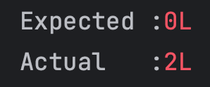

# Redis 

# Redis TTL 이슈
레디스의 학습 테스트를 진행 하던 중 TTL 설정 시 발생하는 이슈를 확인 할 수 있었다.

다음과 같은 도메인이 있다.

```java
@Getter
@NoArgsConstructor(access = AccessLevel.PROTECTED)
@RedisHash(value = "fruits", timeToLive = 1)
public class Fruits {

    @Id
    private String id;

    private String name;

    private Integer stock;

    @Indexed
    private LocalDateTime createdAt;

    @Builder
    private Fruits(String name, Integer stock, LocalDateTime createTime) {
        this.name = name;
        this.stock = stock;
        this.createdAt = createTime;
    }

    public static Fruits createFruit(String name, Integer stock, LocalDateTime createTime) {
        return Fruits.builder()
                .name(name)
                .stock(stock)
                .createTime(createTime)
                .build();
    }
}
```

TTL이 1초이기때문에 1초 뒤에는 Redis에 저장됐던 데이터가 삭제되어있음을 예상하고 다음과 같이 테스트 코드를 작성했다.

```java
    @DisplayName("TTL을 지정했을 때 이후에 탐색이 되면 안된다.")
    @Test
    void findExceedTTLFruits() throws InterruptedException {
        // given
        LocalDateTime saveTime = LocalDateTime.now();
        Fruits apple = Fruits.createFruit("사과", 10, saveTime);
        Fruits banana = Fruits.createFruit("바나나", 15, saveTime);

        fruitsRepository.save(apple);
        fruitsRepository.save(banana);
        
        // when
        Thread.sleep(1000);
        Optional<Fruits> findBanana = fruitsRepository.findById(banana.getId());
        long count = fruitsRepository.count();

        // then
        assertThat(findBanana).isEmpty();
        assertThat(count).isEqualTo(0);
    }
```

그리고 예상과 달리 결과는 다음과 같이 나오게 되었다.



저장했던 객체 자체를 참조하고자 할 경우에는 데이터가 없는 것을 볼 수 있지만, 현재 Set에 저장된 데이터는 삭제가 되어있지 않아 데이터 정합성에 문제가 생긴 것이였다.

이를 해결하기 위해서는 TTL이 만료가 되었을 경우 만료가 되었는지 파악하기 위한 이벤트를 받을 필요가 있었다.
그리고 스프링 부트는 이벤트를 받을 수 있게 해주는 애노테이션을 제공해주고 있었다.

```java
@SpringBootTest
@EnableRedisRepositories(enableKeyspaceEvents = RedisKeyValueAdapter.EnableKeyspaceEvents.ON_STARTUP)
```

위와 같이 애노테이션을 추가해주고 다시 테스트를 진행해봤다. 하지만 이렇게 추가를 해도 위 테스트는 동일하게 실패를 하게 되었다. 이벤트를 처리하는데 걸리는 시간이 필요해서 그런건가 생각해서 1000ms 이후 테스트가 실행되던 부분을 2000ms로 수정을 하였고, 예상대로 테스트가 통과하는 것을 볼 수 있었다.

[참고]
https://hyperconnect.github.io/2022/12/12/fix-increasing-memory-usage.html