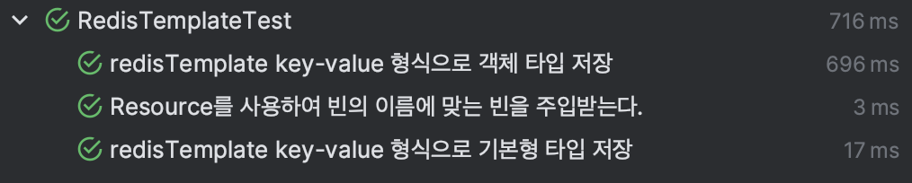

# Redis 

# Redis TTL 이슈
레디스의 학습 테스트를 진행 하던 중 TTL 설정 시 발생하는 이슈를 확인 할 수 있었다.

다음과 같은 도메인이 있다.

```java
@Getter
@NoArgsConstructor(access = AccessLevel.PROTECTED)
@RedisHash(value = "fruits", timeToLive = 1)
public class Fruits {

    @Id
    private String id;

    private String name;

    private Integer stock;

    @Indexed
    private LocalDateTime createdAt;

    @Builder
    private Fruits(String name, Integer stock, LocalDateTime createTime) {
        this.name = name;
        this.stock = stock;
        this.createdAt = createTime;
    }

    public static Fruits createFruit(String name, Integer stock, LocalDateTime createTime) {
        return Fruits.builder()
                .name(name)
                .stock(stock)
                .createTime(createTime)
                .build();
    }
}
```

TTL이 1초이기때문에 1초 뒤에는 Redis에 저장됐던 데이터가 삭제되어있음을 예상하고 다음과 같이 테스트 코드를 작성했다.

```java
    @DisplayName("TTL을 지정했을 때 이후에 탐색이 되면 안된다.")
    @Test
    void findExceedTTLFruits() throws InterruptedException {
        // given
        LocalDateTime saveTime = LocalDateTime.now();
        Fruits apple = Fruits.createFruit("사과", 10, saveTime);
        Fruits banana = Fruits.createFruit("바나나", 15, saveTime);

        fruitsRepository.save(apple);
        fruitsRepository.save(banana);
        
        // when
        Thread.sleep(1000);
        Optional<Fruits> findBanana = fruitsRepository.findById(banana.getId());
        long count = fruitsRepository.count();

        // then
        assertThat(findBanana).isEmpty();
        assertThat(count).isEqualTo(0);
    }
```

그리고 예상과 달리 결과는 다음과 같이 나오게 되었다.


저장했던 객체 자체를 참조하고자 할 경우에는 데이터가 없는 것을 볼 수 있지만, 현재 Set에 저장된 데이터는 삭제가 되어있지 않아 데이터 정합성에 문제가 생긴 것이였다.

이를 해결하기 위해서는 TTL이 만료가 되었을 경우 만료가 되었는지 파악하기 위한 이벤트를 받을 필요가 있었다.
그리고 스프링 부트는 이벤트를 받을 수 있게 해주는 애노테이션을 제공해주고 있었다.

```java
@SpringBootTest
@EnableRedisRepositories(enableKeyspaceEvents = RedisKeyValueAdapter.EnableKeyspaceEvents.ON_STARTUP)
```

위와 같이 애노테이션을 추가해주고 다시 테스트를 진행해봤다. 하지만 이렇게 추가를 해도 위 테스트는 동일하게 실패를 하게 되었다. 이벤트를 처리하는데 걸리는 시간이 필요해서 그런건가 생각해서 1000ms 이후 테스트가 실행되던 부분을 2000ms로 수정을 하였고, 예상대로 테스트가 통과하는 것을 볼 수 있었다.

[참고]
https://hyperconnect.github.io/2022/12/12/fix-increasing-memory-usage.html

## Redis LocalDateTime Serialize Issue
Spring Data Redis는 Key-Value 구조의 자료구조만 사용하기 때문에 다른 자료구조도 테스트 해보기 위하여 RedisTemplate를 직접 만들어서 학습 테스트를 진행해봤습니다.

```java
redisTemplate.opsForValue();
```

를 사용하여 key-value 자료구조에 대해서 Primitive Type, Reference Type 두 경우에 대해서 테스트를 진행해보고자 하였습니다.

```java
    @DisplayName("redisTemplate key-value 형식으로 기본형 타입 저장")
    @Test
    void saveValueOpsPrimitiveType() {
        // given
        ValueOperations<String, Object> stringObjectValueOperations = redisTemplate.opsForValue();

        String key = "KEY";
        stringObjectValueOperations.set(key, 1);
        stringObjectValueOperations.set(key, 2);
        stringObjectValueOperations.set(key, 3);

        // when
        Integer value = (Integer) stringObjectValueOperations.get(key);
        Set<String> keys = redisTemplate.keys(key);

        // then
        assertThat(keys.size()).isEqualTo(1);
        assertThat(value).isEqualTo(3);
    }
```

먼저, key-value로 기본형 타입을 저장하는 테스트를 진행해봤습니다. 예상대로 마지막 key에 대한 값이 덮어져서 가져와지는 것을 확인 할 수 있었습니다.

다음으로 객체 타입을 저장하려고 시도하였습니다.
먼저, RedisTemplate는 다음과 같이 생성을 했었습니다.

```java
    @Bean(name = "defaultRedisTemplate")
    public RedisTemplate<String, Object> redisTemplate(RedisConnectionFactory redisConnectionFactory) {
        RedisTemplate<String, Object> redisTemplate = new RedisTemplate<>();
        redisTemplate.setKeySerializer(new StringRedisSerializer());
        redisTemplate.setValueSerializer(new Jackson2JsonRedisSerializer<>(Object.class));
        redisTemplate.setConnectionFactory(redisConnectionFactory);
        return redisTemplate;
    }
```

이어서, 기본 값 타입 테스트와 비슷하게 다음과 같이 테스트를 작성하였습니다.
```java
    @DisplayName("redisTemplate key-value 형식으로 객체 타입 저장")
    @Test
    void saveValueOpsReferenceType() {
        // given
        ValueOperations<String, Object> stringObjectValueOperations = redisTemplate.opsForValue();
        String key = "ReferenceKey";

        LocalDateTime serverTime = LocalDateTime.now();

        Fruits apple = Fruits.createFruit("사과", 10, serverTime);
        Fruits banana = Fruits.createFruit("바나나", 15, serverTime);

        stringObjectValueOperations.set(key, apple);
        stringObjectValueOperations.set(key, banana);
        Set<String> keys = redisTemplate.keys(key);

        // when
        Fruits value = (Fruits) stringObjectValueOperations.get(key);

        // then
        assertThat(keys.size()).isEqualTo(1);
        assertThat(value).usingRecursiveComparison().isEqualTo(banana);
    }
```

위와 큰 차이가 없기 때문에 가뿐하게 통과 할 줄 알았으나, 테스트는 실패를 했습니다.
에러를 살펴보니 다음과 같은 메시지가 있었습니다.

```bash
Could not write JSON: Java 8 date/time type `java.time.LocalDateTime` not supported by default: add Module "com.fasterxml.jackson.datatype:jackson-datatype-jsr310" to enable handling (through reference chain: com.example.redis.domain.redis.Fruits["createdAt"])
```
LocalDateTime을 Serialize 할 수 없으니 jsr310 Module을 추가해달라는 것이었습니다.
다음과 같이 라이브러리 의존성을 추가해주었습니다.

```gradle
implementation group: 'com.fasterxml.jackson.datatype', name: 'jackson-datatype-jsr310', version: '2.16.0'
```
그러나, 똑같은 에러가 나타나게 되었습니다.

해당 에러를 해결하기 위해 구글링을 한 결과 한 포스팅에서 해답을 찾을 수 있었습니다.

https://velog.io/@bagt/Redis-%EC%97%AD%EC%A7%81%EB%A0%AC%ED%99%94-%EC%82%BD%EC%A7%88%EA%B8%B0-feat.-RedisSerializer

해당 포스팅을 참고하여 Redis를 위한 ObjectMapper를 커스터마이징 해주고 RedisTemplate에 다음과 같이 주입해주었습니다.

```java
    @Bean(name = "redisObjectMapper")
    public ObjectMapper redisObjectMapper() {
        BasicPolymorphicTypeValidator validator = BasicPolymorphicTypeValidator.builder()
                .allowIfSubType(Object.class)
                .build();

        ObjectMapper objectMapper = new ObjectMapper();
        objectMapper.registerModule(new JavaTimeModule());
        objectMapper.activateDefaultTyping(validator, ObjectMapper.DefaultTyping.NON_FINAL);
        return objectMapper;
    }

    @Bean(name = "defaultRedisTemplate")
    public RedisTemplate<String, Object> redisTemplate(RedisConnectionFactory redisConnectionFactory,
                                                      @Qualifier("redisObjectMapper") ObjectMapper objectMapper) {
        RedisTemplate<String, Object> redisTemplate = new RedisTemplate<>();
        redisTemplate.setKeySerializer(new StringRedisSerializer());
        redisTemplate.setValueSerializer(new GenericJackson2JsonRedisSerializer(objectMapper));
        redisTemplate.setConnectionFactory(redisConnectionFactory);
        return redisTemplate;
    }
```
그리고 결과는 아래와 같이 성공하는 것을 볼 수 있었습니다.



[참고]
https://velog.io/@bagt/Redis-%EC%97%AD%EC%A7%81%EB%A0%AC%ED%99%94-%EC%82%BD%EC%A7%88%EA%B8%B0-feat.-RedisSerializer

---
## Redis Template 사용 시 주의사항
최근 Redis 학습 테스트를 진행하면서 발생했던 이슈를 하나 공유하고자합니다.

Redis의 자료구조 중 set 자료구조를 테스트 하고자 하였습니다. 해당 테스트 코드는 다음과 같습니다.
```java
    @DisplayName("restTemplate key-value(Set) 형식으로 저장한다.")
    @Test
    void saveSetForOps() {
        // given
        SetOperations<String, Object> stringObjectSetOperations = redisTemplate.opsForSet();
        String KEY = "setKey";

        LocalDateTime serverTime = LocalDateTime.now();
        Fruits apple = Fruits.createFruit("사과", 10, serverTime);
        Fruits apple2 = Fruits.createFruit("사과", 10, serverTime);
        Fruits banana = Fruits.createFruit("바나나", 15, serverTime);
        Fruits waterMellon = Fruits.createFruit("수박", 13, serverTime);

        stringObjectSetOperations.add(KEY, apple, banana, waterMellon, apple2);

        // when
        Set<Object> sets = stringObjectSetOperations.members(KEY);

        // then
        assertThat(sets.size()).isEqualTo(3);
        assertThat(stringObjectSetOperations.isMember(KEY, apple)).isTrue();

        // 객체 내부의 값이 같기때문에 true 이다.
        assertThat(stringObjectSetOperations.isMember(KEY, apple2)).isTrue();
        assertThat(stringObjectSetOperations.isMember(KEY, banana)).isTrue();
        assertThat(stringObjectSetOperations.isMember(KEY, waterMellon)).isTrue();
    }
```

해당 테스트 코드를 만들고 수행 했을 때 다음과 같이 전체적으로 통과하는 모습을 볼 수 있습니다.


해당 테스트 코드를 조금 수정하고 다시 테스트를 진행해봤습니다. 학습 테스트를 진행중이기 때문에 내가 어떠한 값을 잘 못 지정해주었을 가능성이 있기에 테스트의 결과를 확인해봤습니다.


전혀 예상하지 못한 곳에서 실패를 한 것을 볼 수 있었습니다. set 자료구조를 사용하는 곳도 해당 테스트 하나 뿐이었는데 정말 당황스러웠습니다.

데이터를 더 추가 한 것도 아니고 추가가 되어야 할 이유가 없어보였습니다.

이렇게 생각했던 이유는 해당 테스트 클래스가 TestContainer가 적용되어있다고 생각했었기 때문입니다. 

또한 위와 별개로 테스트 코드를 수행 할 때마다 스프링 부트 서버가 띄워지니 RedisTemplate도 새로이 갱신이 되지 않을까? 하는 생각을 했습니다.
하지만, 다시 생각해보니 Redis는 원격 서버이기에 Spring Boot 서버와는 별개로 띄워져야했습니다. 

먼저 TestContainer가 적용이 안되어있나 확인을 했고, 이전에 만들어두었던 Redis TestContainer를 띄워주었습니다.

```java
public class RedisIntegrationTest {

    private static GenericContainer<?> redis = new GenericContainer<>(DockerImageName.parse("redis:5.0.3-alpine"))
            .withExposedPorts(6379);

    @BeforeAll
    public static void setUp() {
        redis.start();
        System.setProperty("spring.data.redis.host", redis.getHost());
        System.setProperty("spring.data.redis.port", redis.getMappedPort(6379).toString());
    }

    @AfterAll
    public static void tearDown() {
        redis.stop();
    }
}

@SpringBootTest
public class RedisTemplateTest extends RedisIntegrationTest{
    ...
}
```

다시 테스트를 돌려보았고 해당 테스트는 정상적으로 수행을 된 것을 볼 수 있었습니다.
그렇다면 어딘가에 redis 서버가 띄워져있다는 것을 짐작 할 수 있었고, 이전에 yml에 다음과 같이 명시해주었던 것을 확인했습니다.

```yml
spring:
  data:
    redis:
      host: localhost
      port: 6379
```

바로 localhost에 redis가 띄워져 있는 것을 확인해봤습니다.


예상했던 것처럼 프로세스 자체적으로 redis가 띄워져있는 것을 볼 수 있었습니다.
제가 레디스를 프로세스로 따로 띄우지는 않았기때문에 스프링 서버가 띄워지면서 어디선가 redis를 실행하는 것으로 예상하고 로그를 debug로 변경하였습니다.

```yml
logging:
  level:
    root: DEBUG
```

그리고 로그를 찾아내려가니 다음과 같은 로그들을 확인 할 수 있었습니다.
```bash
2023-12-13T18:16:36.607+09:00 DEBUG 70220 --- [    Test worker] o.s.d.redis.core.RedisConnectionUtils    : Fetching Redis Connection from RedisConnectionFactory
2023-12-13T18:16:36.608+09:00 DEBUG 70220 --- [    Test worker] io.lettuce.core.RedisClient              : Trying to get a Redis connection for: redis://localhost
...
2023-12-13T18:16:36.826+09:00 DEBUG 70220 --- [    Test worker] io.lettuce.core.RedisClient              : Resolved SocketAddress localhost/<unresolved>:6379 using redis://localhost
2023-12-13T18:16:36.827+09:00 DEBUG 70220 --- [    Test worker] io.lettuce.core.AbstractRedisClient      : Connecting to Redis at localhost/<unresolved>:6379
```
다음과 같이 SpringBoot가 자제적으로 명시되어있는 host와 port를 가지고 redis를 찾아서 띄우는 것을 볼 수 있었습니다. 

만약 컴퓨터 자체에 Redis가 설치가 되어있지 않았다면 해당 테스트를 수행하면서 예외가 빠르게 발생했을 것 같다고 생각됩니다.

테스트 코드는 어떤 상황이든 항상 동일한 값을 도출해야하기 때문에 값이 바뀔 수 있는 서버를 사용하기보다 위처럼 TestContainer를 사용하여 테스트의 정합성을 보장해야 할 것입니다.